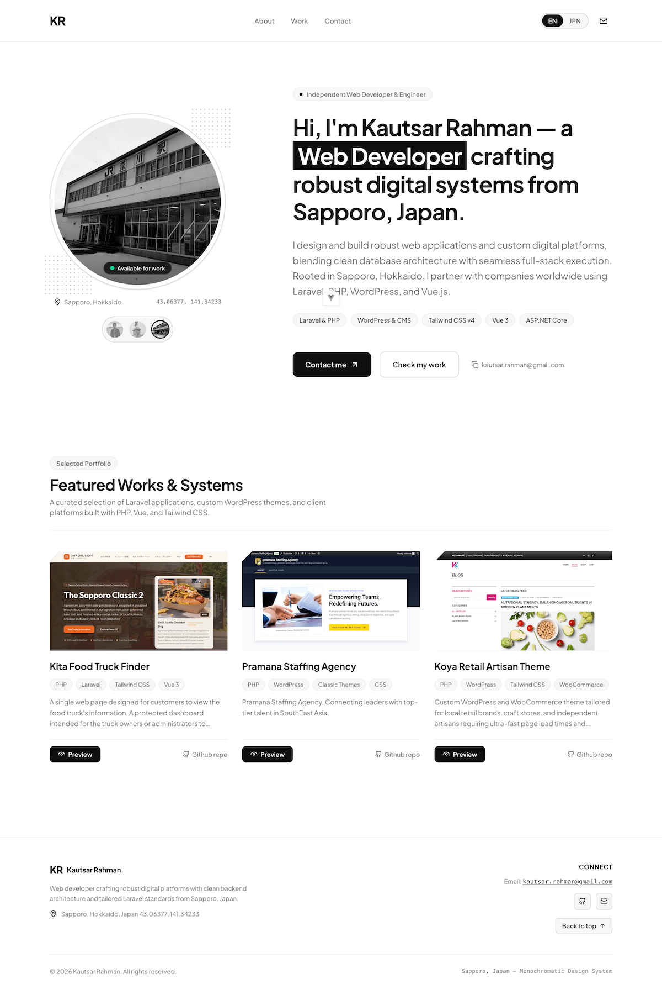

# Kautsar Rahman — Portfolio

A bilingual (EN / JA) developer portfolio built as a fully static Vue 3 single-page app. There is
no backend, database, or server process — the production build is plain HTML, CSS, JS and image
files that can be uploaded to any static host.



---

## Stack

|           |                                                                 |
| --------- | --------------------------------------------------------------- |
| Framework | Vue 3 — Composition API, `<script setup>`, JavaScript           |
| Build     | Vite 7                                                          |
| Styling   | Tailwind CSS v4 (`@tailwindcss/vite`)                           |
| Content   | Static JSON in `src/data/`, interface strings in `src/locales/` |
| Hosting   | Any static host, served from the **domain root**                |

**Deliberately absent** (see PRD §3 and §11): no Vue Router — project details are a modal, not
routes; no Pinia — two small module-level composables cover the shared state; no contact form; no
analytics.

## Getting started

```sh
npm install
npm run dev       # dev server with hot reload
npm run build     # production build -> dist/
npm run preview   # serve dist/ locally, to check the real build
```

Requires Node `^20.19.0 || >=22.12.0`.

## Project structure

```
public/
└── assets/
    ├── profile/                 profile photos (avatar-1.jpg, …)
    └── works/<project-id>/      project screenshots (1.jpg, 2.jpg, …)
src/
├── assets/main.css              design tokens + shared utilities
├── components/
│   ├── layout/                  NavBar, Footer
│   ├── hero/                    HeroSection, AvatarSwitcher, SkillPills
│   └── work/                    WorkSection, ProjectCard, ProjectModal, ImageCarousel
├── composables/
│   ├── useLocale.js             language state, persistence, t() / tl()
│   ├── useProfile.js            selected profile photo + persistence
│   └── useFocusTrap.js          modal focus trap and focus restore
├── data/
│   ├── profile.json             everything about you
│   └── works.json               one entry per project
└── locales/
    ├── en.json                  interface labels (English)
    └── ja.json                  interface labels (Japanese)
```

`template.html` in the repo root is the original static page and the **visual source of truth** —
check it when a layout or style question comes up. The requirements and build plan live in
`.context/` (see [Reference](#reference)).

---

## Maintaining the site

Everything below is a content change. **No `.vue` file needs editing.**

### Add or edit a project

**1. Add the screenshots** to `public/assets/works/<project-id>/`, numbered from `1`:

```
public/assets/works/my-project/1.jpg
public/assets/works/my-project/2.jpg
public/assets/works/my-project/3.jpg
```

- **At least 3 images per project** (4 is ideal). Fewer than 3 fails the content requirement.
- `<project-id>` must match the `id` used in `works.json`.
- Aim for a **consistent shape** within a project — the carousel uses a fixed 4:3 frame and crops
  to fit, so mixing tall and wide screenshots discards a lot. Around **1200×900** works well.

**2. Add an entry to `src/data/works.json`:**

```json
{
  "id": "my-project",
  "category": "WEB APPS",
  "sortOrder": 4,
  "title": { "en": "My Project", "ja": "マイプロジェクト" },
  "description": { "en": "What it does, in a sentence or two.", "ja": "…" },
  "stats": "Short highlight • Another highlight",
  "tags": ["Laravel", "Vue 3", "Tailwind CSS"],
  "githubUrl": "https://github.com/krahman80/my-project",
  "previewUrl": "https://my-project.example.com",
  "images": [
    { "src": "/assets/works/my-project/1.jpg", "alt": "Homepage hero" },
    { "src": "/assets/works/my-project/2.jpg", "alt": "Pricing section" },
    { "src": "/assets/works/my-project/3.jpg", "alt": "Admin dashboard" }
  ]
}
```

| Field                     | Notes                                                              |
| ------------------------- | ------------------------------------------------------------------ |
| `id`                      | Lowercase, hyphenated. **Must match the image folder name.**       |
| `sortOrder`               | Display order, low to high                                         |
| `title`, `description`    | Both **must** have `en` and `ja`                                   |
| `stats`                   | Shown on the card cover and in the modal. **Not translated**       |
| `category`                | Shown in the modal banner. **Not translated**                      |
| `tags`                    | Plain list — technology names, not translated                      |
| `images[0]`               | **Is the card's cover image.** Put your strongest screenshot first |
| `images[].alt`            | Screen-reader text. **Not translated** — a plain English string    |
| `githubUrl`, `previewUrl` | Open in a new tab from the card and the modal                      |

> **Path rule.** `src` must be the URL as it will be served, because the `src` value _is_ the
> requested path in production. Vite copies `public/` verbatim to the site root, so
> `/assets/works/my-project/1.jpg` is correct.
>
> Do **not** move these into `src/assets/`. Files there are renamed and hashed by the build
> (`dist/assets/1-C4IEsjFB.jpg`), which would break every path in the JSON.

### Change your profile details

Edit `src/data/profile.json`:

- `name`, `email`, `social.github`, `social.linkedin`
- `role`, `status`, `bio`, `bioShort` — each needs `en` **and** `ja`
- `location.city`, `location.coords`
- `skills` — a plain list, rendered as pills under the headline. Not translated.

### Add or swap a profile photo

**1.** Put the file in `public/assets/profile/`, e.g. `public/assets/profile/avatar-6.jpg`.

**2.** Add it to `avatars[]` in `src/data/profile.json`:

```json
{
  "id": "avatar-4",
  "src": "/assets/profile/avatar-6.jpg",
  "alt": "Kautsar Rahman portrait, option 4"
}
```

`id` is only a unique label — it does not have to match the filename. `alt` is read aloud by
screen readers, so describe the photo.

**3.** `defaultAvatarId` decides which photo a first-time visitor sees.

> The picker shows **every entry in `avatars[]`**. To remove a photo from the picker, delete its
> entry; leaving the unused file on disk is harmless.

### Edit interface text

`src/locales/en.json` and `src/locales/ja.json` hold **interface labels only** — nav items, button
text, section headings, aria-labels.

Keep the two files in step: every key in one should exist in the other, because a missing key
silently falls back to English rather than failing loudly.

Personal and project content does **not** belong here. It lives in `profile.json` / `works.json`
as `{ "en": "…", "ja": "…" }` pairs.

### Change colours

Every colour is a token in the `@theme` block of `src/assets/main.css`. Components use the
generated utilities — `text-primary`, `bg-pill-bg`, `border-hairline`, `hover:bg-primary-hover` —
rather than literal hex values, so **changing one token updates the whole site**.

Keep any new or adjusted colour at **4.5:1 contrast** against the background it sits on, to stay
WCAG AA compliant. Contrast is verified per token, not guaranteed by the palette.

---

## Deployment

`npm run build` produces a self-contained `dist/`. Upload its **contents** to the web root of your
host — no server process, runtime, or database is required.

The site is served from the **domain root**, so the default Vite `base` is correct and no override
is needed. If it ever moves into a subdirectory, set `base` in `vite.config.js` to match.

---

## Reference

| Document                                  | Purpose                                                                              |
| ----------------------------------------- | ------------------------------------------------------------------------------------ |
| `.context/Portofolio-PRD.md`              | Requirements, data model, accessibility and performance targets, confirmed decisions |
| `.context/Portofolio-DEVELOPMENT-PLAN.md` | Sprint-by-sprint build plan and deliverables                                         |
| `.github/copilot-instructions.md`         | Conventions followed when changing the code                                          |
| `template.html`                           | Original static page — the visual reference                                          |

### Behaviour worth knowing

- The chosen **language** persists in `localStorage` under `portfolio:locale` (defaults to English
  on a first visit), and the chosen **profile photo** under `portfolio:avatar`.
- Modals trap keyboard focus and return it to the card that opened them. `Esc`, the close button,
  and a backdrop click all dismiss.
- All animation respects `prefers-reduced-motion`.
- The carousel never auto-advances.
